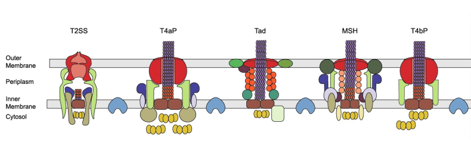

# HPC-AI - Introduction to machine learning - Final project

Predicting the function of a protein is one core challenge in biology. Protein
function is typically inferred using sequence comparison with proteins whose
function is known. This is problematic in many ways. In particular, proteins
can have very different sequences, and yet share the same function. Machine
learning approaches are thus more and more investigated to go beyond sequence
similarity when annotating protein functions in new organism.

This project is about investigating machine learning strategies to infer
whether a protein is involved in a secretion system. 

Secretion systems are complexes of proteins enabling a number of essential
functions for prokaryotic organisms (bacteria and archaea) such as acquiring
nutrients or invading host cells. There are currently 12 types of secretion
systems known, but we have very strong evidence to believe there are more
secretion systems types: annotating the entier set of genomes with those 12
types of secretion systems shows that some bacteria don't have any. Because of
the importance of secretion systems to interact with the environment and with
each other, as well as the difficulty of finding novel secretion systems (12
years of research in an experimental lab for the last type of secretion system
found), we believe that there are entire types of secretion systems yet to
discover.

## The dataset

The dataset can be downloaded
[here](https://filesender.renater.fr/?s=download&token=9ca0e7df-8929-4aab-97cd-3c1dfff0282c)

We downloaded the whole set of complete prokaryotic genomes in 2021 (30,000
genomes in total). We then annotated each protein of each genome as being part
of a protein family known to be involved in secretion systems (complexes of
proteins that allow the bacteria to secrete a number of elements, including
toxins). The annotation of each protein is done through sequence comparison
between the protein's sequence and an "average" sequence of a protein family. 

The goal is to predict whether a protein is part of a secretion system.

The data handed in to you is:

- The folder `partial_dataset_train` contains the training data at your
  disposition:
    
    - `protein_sequences.csv` contains two columns. The first one corresponds
      to a unique identifier for the protein of the form
      `GCA_000474035.1_ASM47403v1.AGX32190.1` (`organism_ref.protein_ref`).
      Then follows the protein sequence. 
    - `features.csv` contains a series of features extracted from the protein
      sequence (amino acid proportion, di-amino acid proportion, entropy, bio
      physical proporties, deep learning embedding "word 2 vec" approache,
      etc).
    - `labels.csv` contains the information of whether the protein is part of
      one of the secretion system types we could annotate.
    - `complete_labels.csv` contains not only whether the protein is part of
      one of the secretion system types annotated, but also which of these
      systems it is part of. *Some secretion system types were purposedly
      ignored in the labels handed to you in the training data.*

- The folder `partial_dataset_valid` contains the features extracted, the
  protein sequence, and the labels.
- The folder `partial_dataset_test` contains the feature extracted and the
  protein sequence.

## PHASE 1 Preliminary analysis of the dataset and analysis plan

**Due date:** December 7th, 2022

Send the report (in english) to: nelle.varoquaux@cnrs.fr

The first part of this project is to perform a preliminary analysis of the
dataset. You will do this by exploring the `labels.csv` and
`complete_labels.csv` of the training data.

- How many proteins are in this dataset?
- What is the proportion of positive labels in the dataset? What is the
  proportion of negative labels? What metric(s) would be appropriate to
  validate the machine learning pipeline? Justify each of the metrics used.
- Now, looking at the complete list of labels, what is the number of elements
  in each category? What is the proportion of proteins labeled in two
  categories?
- Identify and describe three challenges when working on this machine learning
  problem.
- Devise (on paper) a cross-validation strategy that would enable to check
  that the machine learning pipeline would extend to secretion systems **not**
  annotated in our dataset. You can write a pseudo-algorithm describing the
  cross validation strategy, or draw a schema explain your though. Explain how
  this cross validation strategy is a good way to check for generalization in
  this setting.

## PHASE 2. Predicting protein function from it's sequence

**Due date:** January, 18th, 2023
Send the report to: nelle.varoquaux@cnrs.fr

More information will be uploaded on December 8th.
